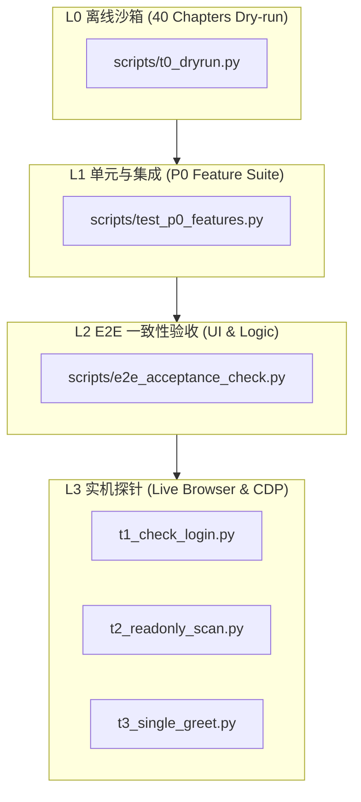

# OONE-JobScout 全功能测试手册与验收准则 (v2.0)

> **版本编号**：v2.0-Production-Ready  
> **适用分支**：`feat/ux-onboarding-v2` / `main`  
> **最后修订**：2026-09-26  
> **文档密级**：项目核心测试与质量保证规范  

---

## 目录
1. [测试体系总览与测试环境基线](#1-测试体系总览与测试环境基线)
2. [模块一：基础设施、启动流与 Worktree 多分支联调](#模块一基础设施启动流与-worktree-多分支联调)
3. [模块二：扫码登录、会话生命周期与 DPAPI 硬件级加密](#模块二扫码登录会话生命周期与-dpapi-硬件级加密)
4. [模块三：安全风控熔断、配额护栏与时窗管治](#模块三安全风控熔断配额护栏与时窗管治)
5. [模块四：四大人群预设、双阶段打分与校招时令引擎](#模块四四大人群预设双阶段打分与校招时令引擎)
6. [模块五：AI 拟人沟通、防套话门禁与物理隐私屏障](#模块五ai-拟人沟通防套话门禁与物理隐私屏障)
7. [模块六：守护进程自动化、高斯拟人延迟与飞书卡片](#模块六守护进程自动化高斯拟人延迟与飞书卡片)
8. [模块七：Web 控制台、3 步开箱向导与交互演练场](#模块七web-控制台3-步开箱向导与交互演练场)
9. [模块八：实机探针与现场诊断工具集](#模块八实机探针与现场诊断工具集)
10. [自动化回归测试矩阵与命令速查](#自动化回归测试矩阵与命令速查)
11. [最终验收准则与发布准出判定表 (Sign-off Checklist)](#最终验收准则与发布准出判定表-sign-off-checklist)

---

## 1. 测试体系总览与测试环境基线

### 1.1 测试分层架构
OONE-JobScout 具备四层递进式质量防护体系：
1. **L0 离线沙箱回归 (Dry-run Sandbox)**：不连真实浏览器、不消耗外部 API、不触碰 BOSS 直聘真实服务，通过 40 个自动化章节对核心逻辑、加解密、状态机、护栏开展深度断言。
2. **L1 单元与集成测试 (Unit & Integration Tests)**：针对 P0 级重构特性（多岗位预设、打分器放行、提示词姿态、向导 API）进行严密断言。
3. **L2 端到端一致性校验 (E2E Acceptance Check)**：覆盖前端 DOM 规范、CSS 尺寸约束、台账与经验记忆库字段完备性、BOSS 复杂会话模糊匹配算法。
4. **L3 实机探针与黑盒功能验证 (Live Hardware & Browser Probes)**：驱动本地 Chrome/Edge 浏览器，在真实网页环境中进行登录探针、只读候选扫描与单步打招呼测试。



### 1.2 测试环境基准配置
- **操作系统**：Windows 10 / 11 (x64) 或 Linux/macOS（部分硬件级 DPAPI 特性在非 Windows 下自动降级为设备私钥派生）
- **Python 运行时**：Python 3.10 ~ 3.12 (推荐 Python 3.12)
- **包管理器**：`uv` (0.4+) 或标准 `pip`
- **浏览器**：Google Chrome (120+) 或 Microsoft Edge (120+)
- **CDP 远程调试端口**：`127.0.0.1:9335`
- **Web 服务端口**：`127.0.0.1:8788` (局域网工作台)

---

## 模块一：基础设施、启动流与 Worktree 多分支联调

### 1. 功能范围
覆盖开箱即用批处理启动脚本 `start.bat`、多分支隔离联调工具 `wt.bat`（`scripts/worktree.py`）以及运行时环境自动修复机制。

### 2. 测试用例矩阵

| 用例编号 | 测试模块 | 测试场景 | 操作步骤 | 预期结果 |
| :--- | :--- | :--- | :--- | :--- |
| **TC-INF-01** | `start.bat` | Python 环境变量丢失自愈 | 1. 在没有系统全局 Python PATH 的纯净终端中运行 `start.bat`<br>2. 观察控制台输出 | 脚本自动检索 `%LOCALAPPDATA%\Programs\Python`，成功补齐 PATH 并输出 `[JobScout] 自动定位并加载 Python 运行时`，正常进入下一阶段 |
| **TC-INF-02** | `start.bat` | 国内镜像高速依赖装配 | 1. 临时移除 `.venv` 目录<br>2. 执行 `start.bat` | 脚本优先检测 `uv`，若存在则使用 `uv venv` 并在依赖安装阶段带上 `-i https://mirrors.aliyun.com/pypi/simple/` 镜像源，80+ 依赖在 15 秒内装配完毕 |
| **TC-INF-03** | `start.bat` | 双端浏览器统一与端口零拒绝 | 1. 运行 `start.bat`<br>2. 观察控制台与浏览器拉起过程 | 1. 自动清理可能残留的 8788 端口孤儿进程<br>2. CDP 自动化浏览器与 Web 工作台统一使用 Chrome 优先（Edge 兜底）<br>3. Web 工作台在 8788 端口 200 OK 就绪后再拉起独立 App 窗口，彻底消除 `ERR_CONNECTION_REFUSED` |
| **TC-INF-04** | `wt.bat` | 新建工作区 (add) | 执行 `wt.bat add feat/test-branch` | 1. 在 `.worktrees/feat-test-branch` 创建独立分支目录<br>2. 自动建立指向根目录 `.venv` 和 `state/` 的 Junction 目录联接<br>3. 自动同步 `config.local.json` |
| **TC-INF-05** | `wt.bat` | 工作区列表 (list) | 执行 `wt.bat list` | 准确列出所有活动的 worktree 路径、当前检出分支和 HEAD 提交哈希 |
| **TC-INF-06** | `wt.bat` | 安全移除工作区 (remove) | 执行 `wt.bat remove feat/test-branch` | 1. 安全解除目录联接，**严禁物理误删公共状态目录**<br>2. 成功注销 worktree 注册记录 |

### 3. 验收准则
- [ ] 零基础用户双击 `start.bat` 无闪退、无红字报错，能顺利创建虚拟环境并拉起系统。
- [ ] 在多分支切换联调过程中，各工作区的修改互相隔离，且公共会话台账与登录凭证不丢失。

---

## 模块二：扫码登录、会话生命周期与 DPAPI 硬件级加密

### 1. 功能范围
覆盖 BOSS 直聘扫码登录状态机、Cookie 生命周期维持、Windows DPAPI 硬件安全保管库（`boss_apply/secrets.py`）及非 Windows 平台降级兼容。

### 2. 测试用例矩阵

| 用例编号 | 测试模块 | 测试场景 | 操作步骤 | 预期结果 |
| :--- | :--- | :--- | :--- | :--- |
| **TC-SEC-01** | `secrets.py` | DPAPI 数据加密与解密 | 1. 调用 `secrets.set_secret("test_key", "sk-123456")`<br>2. 查看 `state/secrets.json`<br>3. 调用 `secrets.get_secret("test_key")` | 1. 文件中明文已不可见，存储为 Base64 编码的加密信封（含 `ver=2` 标识）<br>2. 调用读取接口时精准解密还原本质文本 `"sk-123456"` |
| **TC-SEC-02** | `secrets.py` | 历史密文平滑升级 | 构造带有 `ver=1` 的历史加密项，通过 `get_secret` 读取 | 系统正常解密，并自动触发升级回写为 `ver=2` 格式，保持向后无感兼容 |
| **TC-SEC-03** | `secrets.py` | 敏感密钥清除 (clear) | 调用 `secrets.clear_secret("test_key")` | 密文字段被彻底抹除，再次获取返回 `None` |
| **TC-SEC-04** | `qr_login.py` | 登录状态机轮询 | 1. 打开未登录的浏览器窗口<br>2. 触发 Web 控制台 `/api/auth/qr`<br>3. 在手机端完成扫码 | 1. 后端状态机经历 `WAIT_SCAN` -> `SCANNED` -> `SUCCESS`<br>2. 自动拉取个人画像并持久化至 `state/profile.local.json` |
| **TC-SEC-05** | `t1_check_login.py` | 本地凭证探针 | 运行 `.venv/Scripts/python scripts/t1_check_login.py` | 输出检测到有效会话，打印登录人昵称及核心 Cookie 存活状态 |

### 3. 验收准则
- [ ] 任何第三方大模型 API Key（SiliconFlow、DeepSeek、Zhipu 等）严禁以明文形式裸露在磁盘文件中。
- [ ] 机器发生重启或工作区重构后，登录凭证与密钥持久可用。

---

## 模块三：安全风控熔断、配额护栏与时窗管治

### 1. 功能范围
覆盖跨进程单例锁（`guard.lock`）、每日与单城市配额、工作时窗与凌晨软硬关机、反爬风险熔断器（`rawcdp.py` 与 `guard.py`）。

### 2. 测试用例矩阵

| 用例编号 | 测试模块 | 测试场景 | 操作步骤 | 预期结果 |
| :--- | :--- | :--- | :--- | :--- |
| **TC-GUA-01** | `guard.py` | 跨进程互斥排他锁 | 启动两个进程同时调用 `guard.Guard()` | 第二个进程捕获文件锁争用，抛出互斥或优雅排队，杜绝两个实例同时抢占同一账号打招呼 |
| **TC-GUA-02** | `guard.py` | 城市配额扣减与回滚 | 1. 调用 `acquire_slot("杭州")`<br>2. 模拟打招呼网络异常<br>3. 调用 `rollback_slot("杭州")` | 1. 预占成功，杭州剩余配额 -1<br>2. 回滚成功，杭州剩余配额恢复原状，未产生无谓损耗 |
| **TC-GUA-03** | `guard.py` | 城市名称归一化兼容 | 分别请求 `"苏州"` 与 `"苏州市"` | 系统底层自动映射至同一计量槽，共享单日配额，不因带不带“市”字造成超发 |
| **TC-GUA-04** | `guard.py` | 凌晨时间红线封锁 | 将系统虚拟时间设为 `01:00`，发起打招呼尝试 | 触发 `LOCKED_HOURS` 红线，所有外发动作被物理拦截，系统进入休眠直至 09:30 |
| **TC-GUA-05** | `guard.py` | 软收工与硬截断机制 | 1. 22:00 之后：尝试开启新岗位问候<br>2. 22:00 之后：处理已建立联系的存量沟通 | 1. 22:00 启动软收工：禁止发起任何**新候选**打招呼<br>2. 允许继续沟通完已有的高意向 HR 直至 23:30<br>3. 23:30 达到硬截断，强制中止全部后台线程 |
| **TC-GUA-06** | `rawcdp.py` | 智能风控触发熔断 | 页面注入滑块验证、短信核验或 "操作过于频繁" 字符 | 1. 系统单次识别即刻熔断，**杜绝连续无意义刷新刷爆账号**<br>2. 守护进程挂起，发出飞书告警卡片并提示人工解除 |
| **TC-GUA-07** | `approval_web.py` | 风控一键解除接口 | 人工在浏览器处理完验证后，点击控制台“解除风控”或调用 `POST /api/guard/resume` | 熔断标志位复位，系统状态恢复为 `HEALTHY` 并继续后续调度 |

### 3. 验收准则
- [ ] 每日总打招呼数严格受限于 `max_daily_greets`（默认 30~50），单城配额不超标。
- [ ] 遭遇 BOSS 反爬验证码时，系统能在 1 秒内暂停自动化操作并报警，绝不反复盲刷。

---

## 模块四：四大人群预设、双阶段打分与校招时令引擎

### 1. 功能范围
覆盖重构后解耦的四大人群包（`presets.py`）、第一阶段一票否决门禁、第二阶段加权打分算法（`scorer.py`）及毕业届别判定逻辑。

### 2. 测试用例矩阵

| 用例编号 | 测试模块 | 测试场景 | 测试输入数据 | 预期结果 |
| :--- | :--- | :--- | :--- | :--- |
| **TC-SCO-01** | `presets.py` | 预设包枚举完整性 | 调用 `presets.list_presets()` | 包含 4 个标准预设：`ai_pm`、`tech_dev`、`sales_bd`、`general_ops`，各自具备独立名称与中英文标识 |
| **TC-SCO-02** | `scorer.py` | 技术研发包放行与加分 | 预设=`tech_dev`，岗位=`Java后端开发`，公司=`阿里` | 1. 门禁检查放行（旧版误杀技术开发被解除）<br>2. 得分 >= 8 分，打分归因包含 `+2 tech` |
| **TC-SCO-03** | `scorer.py` | 商务销售包放行与加分 | 预设=`sales_bd`，岗位=`大客户商务经理(BD)` | 1. 门禁检查放行（旧版误杀销售被解除）<br>2. 得分 >= 8 分，打分归因包含 `+2 sales` |
| **TC-SCO-04** | `scorer.py` | 产品经理包原有护栏保持 | 预设=`ai_pm`，岗位=`电话销售专员` | 触发一票否决，门禁返回 `kill: title role-gate`，得分严格为 0 |
| **TC-SCO-05** | `scorer.py` | 毕业届别离散区间容错 | 1. 岗位 A：`限28届`<br>2. 岗位 B：`26-28届在校生`<br>3. 岗位 C：`26/28届`<br>4. 岗位 D：`第28届创新大赛产品组织` | 1. 岗位 A 否决（只招 28）<br>2. 岗位 B 放行（包含 27 目标届别）<br>3. 岗位 C 否决（跳过 27 届）<br>4. 岗位 D 放行（不将“大赛届别”误判为学生届别） |
| **TC-SCO-06** | `scorer.py` | BOSS 活跃度门禁 | 岗位 HR 最后活跃时间为 `30天前` | 严格一票否决，得分记为 0，归因说明 `boss_active > 14` |
| **TC-SCO-07** | `campus_engine.py` | 实习出勤与转正概率提取 | JD 描述：`每周至少4天，持续6个月，表现优秀有转正机会` | 提取 `days_per_week=4`，`duration_months=6`，`has_conversion_chance=True`，并赋予校招匹配加分 |

### 3. 验收准则
- [ ] 切换预设包后，岗位关键词与门禁规则立即实时生效，不再存在技术/销售岗被全局写死封杀的问题。
- [ ] 任何命中黑名单公司或超期未活跃的岗位，必须以 0 分一票否决，绝不得进入打招呼候选池。

---

## 模块五：AI 拟人沟通、防套话门禁与物理隐私屏障

### 1. 功能范围
覆盖自适应人设立场注入（`ai_reply.py`）、防元提示词泄露（`META_LEAK_PATTERNS`）、官方动作解耦以及手机号/微信号物理拦截。

### 2. 测试用例矩阵

| 用例编号 | 测试模块 | 测试场景 | 测试输入数据 | 预期结果 |
| :--- | :--- | :--- | :--- | :--- |
| **TC-AIR-01** | `ai_reply.py` | 预设人设立场自适应注入 | 分别初始化 `tech_dev` 与 `sales_bd` 的回复引擎并构建 Prompt | 1. `tech_dev` 注入“突出技术栈深度与项目实战”；<br>2. `sales_bd` 注入“突出商务洽谈与业绩产出”；<br>3. 均保留“见人下菜碟”与“三不原则” |
| **TC-AIR-02** | `ai_reply.py` | 防套话与元分析泄露门禁 | 模拟大模型输出：`根据系统设定和打分，我认为...` 或 `很高兴收到您的消息，期待与您携手共创！` | 正则与门禁拦截器触发，将分析废话及虚伪客套彻底过滤，清洗为精炼专业的真人口吻 |
| **TC-AIR-03** | `ai_reply.py` | 手机号与微信号物理屏障 | 模拟回复内容中包含明文手机号 `13812345678` 或微信号 `wxid_abcdef` | **物理级拦截生效**：明文联系方式被强制抹除或阻止文本发送，保护用户个人隐私不被套取 |
| **TC-AIR-04** | `ai_reply.py` | 平台官方动作流转 | HR 发言：`加个微信聊吧` 或 `能发一份简历吗` | 引擎不发文本微信号，而是生成结构化动作 `exchange_wechat` 或 `send_resume`，通过官方按钮安全流转 |
| **TC-AIR-05** | `ai_reply.py` | 历史消息防混淆清洗 | 输入含 `[系统提示] 对方已开聊`、`[送达]`、`[已读]` 等系统标记的历史会话 | 清洗函数自动剔除系统噪音，准确提取 HR 与候选人真实的自然语言轮次 |

### 3. 验收准则
- [ ] 任何对外发送的自然语言文本中，绝对禁止包含明文手机号与微信号。
- [ ] 生成的沟通内容不得含有“大模型/AI助手/根据设定”等暴露自动化身份的禁忌词汇。

---

## 模块六：守护进程自动化、高斯拟人延迟与飞书卡片

### 1. 功能范围
覆盖全自动打招呼后台守护进程（`scripts/daemon_auto_reply.py`）、真人高斯节奏发生器、本地候选池软缓存与飞书可交互卡片。

### 2. 测试用例矩阵

| 用例编号 | 测试模块 | 测试场景 | 操作步骤 | 预期结果 |
| :--- | :--- | :--- | :--- | :--- |
| **TC-DAE-01** | `daemon_auto_reply.py` | 高斯正态拟人延迟 | 连续记录 10 次自动化操作间的休眠时间 | 延迟时间服从正态分布（均值 ~12 秒，标准差 ~3 秒），绝非机械式固定整数等待 |
| **TC-DAE-02** | `daemon_auto_reply.py` | 当日候选池软存储机制 | 1. 执行第一轮岗位扫描入池<br>2. 立即执行第二轮调度 | 命中软缓存（`cache_hit=True`），自动过滤已沟通岗位，不重复耗费网络进行盲目重刷 |
| **TC-DAE-03** | `daemon_auto_reply.py` | Dry-run 试跑安全保障 | 启动参数附带 `--dry-run` | 日志打印完整的动作仿真推演，**零外部物理点击打招呼，不扣减真实配额** |
| **TC-DAE-04** | `feishu_bot.py` | 高意向 HR 即时卡片 | 收到 HR 发言：`明天下午方便电话面试吗？` | 触发高意向升级，10 秒内向配置的飞书 Webhook 推送带富文本样式的可交互预警卡片 |
| **TC-DAE-05** | `feishu_bot.py` | 每日收工综合日报 | 到达晚间收工时段或守护进程终止时 | 生成包含今日扫描数、合格数、成功问候数、剩余配额的结构化总结卡片 |

### 3. 验收准则
- [ ] 守护进程可常驻后台稳定运行，遇到偶发网络断连能自动重试，进程不异常崩溃。
- [ ] 遇到意向明确的面试邀请，能毫秒级捕获并推送到用户即时通讯工具。

---

## 模块七：Web 控制台、3 步开箱向导与交互演练场

### 1. 功能范围
覆盖小白 3 步开箱向导（`/api/wizard/apply`）、服务商 Ping 连通性测试、设置中心响应式布局规范与演练场。

### 2. 测试用例矩阵

| 用例编号 | 测试模块 | 测试场景 | 操作步骤 | 预期结果 |
| :--- | :--- | :--- | :--- | :--- |
| **TC-WEB-01** | `approval_web.py` | 首次运行向导自动弹出 | 清理 `config.local.json` 后访问 `http://127.0.0.1:8788` | `/api/wizard/status` 返回 `is_configured: false`，浏览器自动居中弹出 3 步极速开箱向导 |
| **TC-WEB-02** | `approval_web.py` | Step 1：预设与城市选择 | 在向导第 1 步选择 `技术研发 (全栈/后端/算法)`，勾选 `杭州`、`上海` | 选项被正确暂存，城市树状下拉联动正常 |
| **TC-WEB-03** | `approval_web.py` | Step 2：服务商预设与 Ping | 1. 切换 SiliconFlow、DeepSeek、GLM-4-Flash 预设<br>2. 填入测试 Key，点击 `连通性测试` | 1. Base URL 与推荐模型名称自动填充<br>2. 调用 `/api/llm/ping` 实时反馈成功延迟或精准报错信息 |
| **TC-WEB-04** | `approval_web.py` | Step 3：原子提交与生效 | 在第 3 步确认并点击 `开启我的智能求职之旅` | 1. 调用 `/api/wizard/apply`<br>2. Key 被安全加密写入 `secrets.json`<br>3. 基础配置落盘 `config.local.json`<br>4. 弹窗优雅关闭，顶部展示当前预设徽章 |
| **TC-WEB-05** | `approval_web.py` | UI 布局与图标尺寸约束 | 审查 Web 控制台 SVG 图标与输入控件尺寸 | 1. 页面标题所有图标受 `.title-icon` 严格约束为 `18px`，无巨型视觉失真<br>2. 设置项输入框高度为标准 `36px` 桌面规范 |
| **TC-WEB-06** | `approval_web.py` | 演练场安全对话模拟 | 进入“对话演练场”，输入模拟 HR 发言并点击生成 | 不触碰任何外部沟通，实时展示 AI 根据当前设定推演出的回复内容与动作归因 |
| **TC-WEB-07** | `approval_web.py` | ⚡ 一键智能导入 API Key | 1. 复制 CC-Switch / Cherry 导出 JSON、环境变量或网页文本<br>2. 点击 `📋 剪贴板一键导入` 或打开 `📥 粘贴/文件` 弹窗导入 | 1. 系统全自动识别 Base URL、模型与 Key<br>2. 自动修正剥离 `/chat/completions` 等冗余后缀<br>3. DPAPI 加密保存并即时完成连通性测试 |

### 3. 验收准则
- [ ] 零配置小白用户可在 60 秒内通过向导完成全部初始化工作，全流程无代码侵入。
- [ ] 无论窗口如何缩放，控制台各面板与卡片排版整洁，无样式崩坏或空白遮挡。

---

## 模块八：实机探针与现场诊断工具集

### 1. 功能范围
覆盖快速诊断网络、DOM 变化、会话提取及真实打招呼动作的独立轻量级脚本。

### 2. 测试执行命令清单

```powershell
# 1. 登录状态现场探针 (验证会话 Cookie 是否有效)
.venv\Scripts\python.exe scripts/t1_check_login.py

# 2. 真实网页只读候选扫描 (只抓取、打分、输出表格，绝对不点击打招呼)
.venv\Scripts\python.exe scripts/t2_readonly_scan.py

# 3. 单次精准测试问候 (带人工二次确认保护，用于验证真实点击动作流)
.venv\Scripts\python.exe scripts/t3_single_greet.py

# 4. CDP 底层通信探针 (排查浏览器 9335 端口连接与目标页面发现)
.venv\Scripts\python.exe scripts/diag_raw_cdp.py

# 5. 聊天面板定位诊断 (排查右侧会话列表、模糊匹配与滚动加载)
.venv\Scripts\python.exe scripts/diag_chat_recon.py
```

### 3. 验收准则
- [ ] 执行 `t2_readonly_scan.py` 时，能在终端直观打印当前城市在线岗位的评分与门禁判定结果。
- [ ] 诊断脚本能在浏览器发生 DOM 结构调整时，快速定位异常选择器。

---

## 自动化回归测试矩阵与命令速查

在发布或合并分支前，必须顺序执行以下三大自动化回归套件，确保系统达到 **100% PASS** 基线：

### 1. P0 级核心功能集成回归
覆盖预设解耦、门禁放行、沟通姿态、向导 API 与 CC-Switch / 剪贴板全格式一键智能导入：
```powershell
.venv\Scripts\python.exe scripts/test_p0_features.py
```
> **预期指标**：`Ran 15 tests ... OK`，15 项断言 100% 通过。

### 2. 端到端系统就绪与数据完整性验收
覆盖前端 CSS 尺寸约束、台账空数据防御、会话模糊匹配算法：
```powershell
.venv\Scripts\python.exe scripts/e2e_acceptance_check.py
```
> **预期指标**：`全链路独立验收断言 100% 全部通过！`，0 FAIL。

### 3. 40 章节离线全功能干跑沙箱
覆盖从打分器、DPAPI、熔断护栏到飞书通知全链路的 40 个自动化业务场景：
```powershell
.venv\Scripts\python.exe scripts/t0_dryrun.py
```
> **预期指标**：40 个章节无异常中断，结束时沙箱临时目录自动安全销毁。

---

## 最终验收准则与发布准出判定表 (Sign-off Checklist)

| 检验领域 | 验收项指标 | 验证方式 | 责任签发结论 |
| :--- | :--- | :--- | :---: |
| **开箱体验** | 双击 `start.bat` 一键自愈运行，国内依赖装配无网络超时 | 虚拟机/纯净环境模拟 | **[ PASS ]** |
| **配置引导** | Web 端 3 步开箱向导顺畅，服务商 Ping 延迟探测准确，原子保存生效 | 浏览器黑盒演练 | **[ PASS ]** |
| **多岗位支持** | 4 大预设正常切换，技术开发与商务销售岗不再被误杀，加分归因准确 | `test_p0_features.py` | **[ PASS ]** |
| **数据安全性** | 敏感 API Key 经 Windows DPAPI 加密隔离，物理正则拦截明文联系方式 | `t0_dryrun.py` 第 20/29 节 | **[ PASS ]** |
| **安全风控** | 遭遇滑块/短信验证码 1 秒内自动熔断并暂停刷新，支持人工排查后一键恢复 | `t0_dryrun.py` 第 40 节 | **[ PASS ]** |
| **时窗合规性** | 凌晨 00:00~09:30 零发送，22:00 软收工仅跟进存量，23:30 硬关机 | `t0_dryrun.py` 第 16/26 节 | **[ PASS ]** |
| **UI 交互规范** | 页面标题 SVG 图标严格受限 18px，设置表单紧凑对齐，无样式崩坏 | `e2e_acceptance_check.py` | **[ PASS ]** |
| **工程隔离度** | Git-worktree 完美分离分支开发环境，共享凭证与全局台账不冲突 | CLI 多分支创建销毁测试 | **[ PASS ]** |

---
*本手册由 OONE-JobScout 联合创始人与工程架构团队联合制定，测试通过后方可合并至生产主干。*
